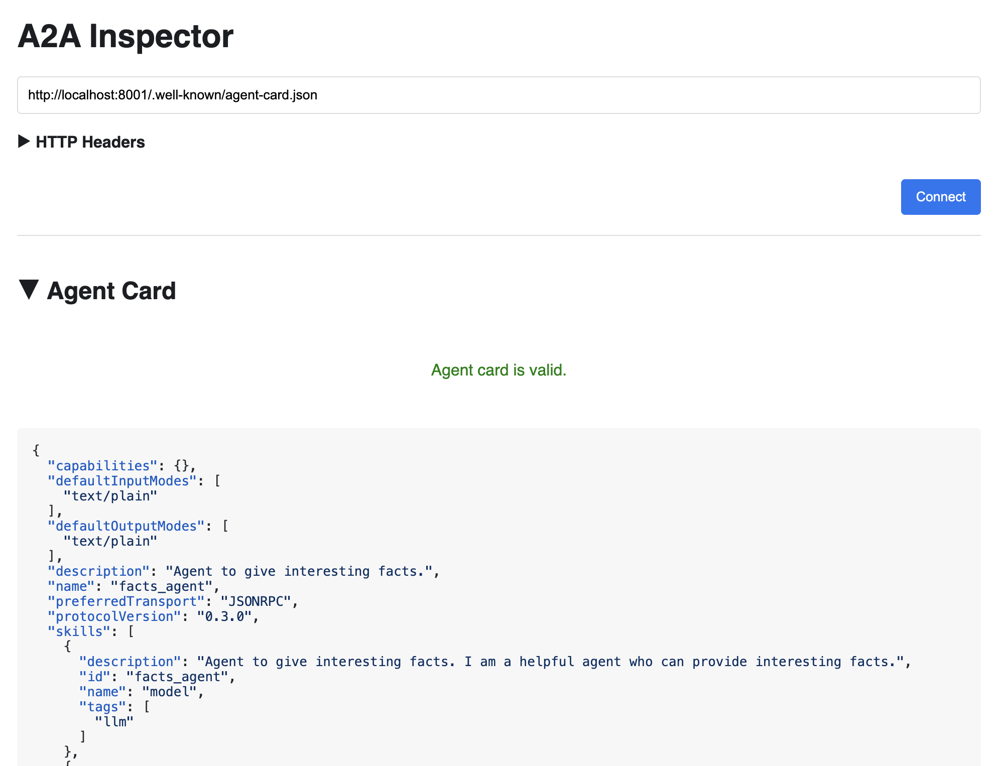
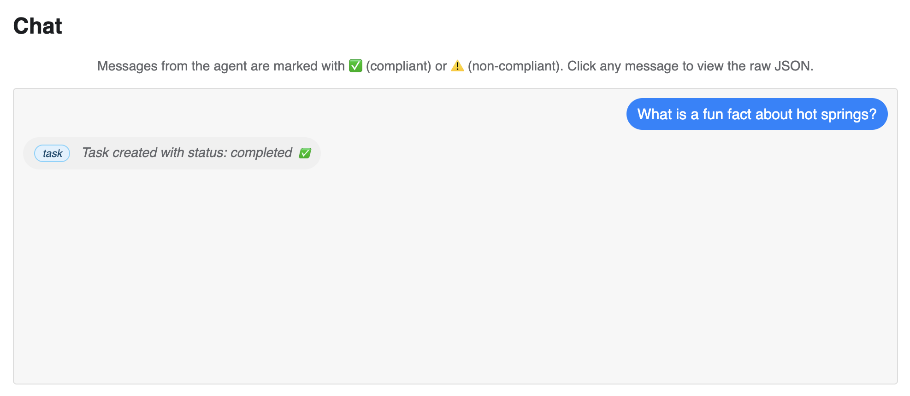
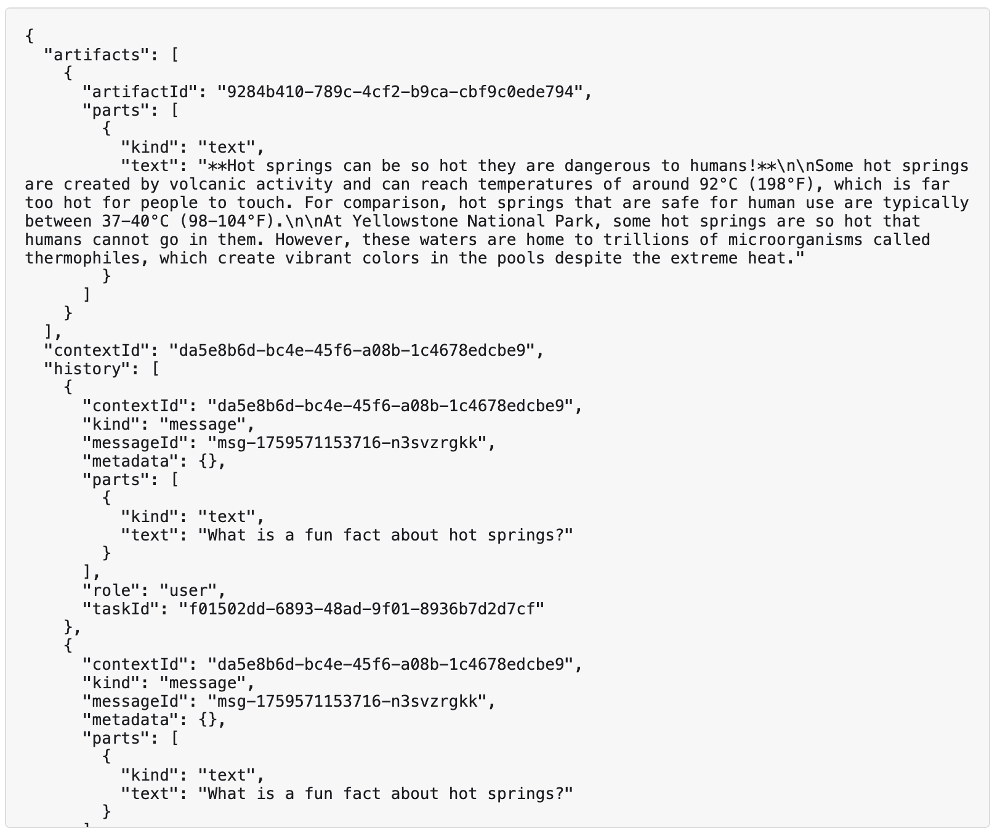

# A2A Boilerplate

This is a repository that helps demonstrate the capabilities of A2A protocol

## Steps to follow

1. Ensure you have [uv](https://docs.astral.sh/uv/), nodejs and npm installed and available in your shell. Also get your free gemini API key from https://aistudio.google.com/api-keys
2. Clone this repository on your computer with mac/linux/WSL2 on windows with Ubuntu or similar linux distro
3. Install the submodules in the git repository with `git submodule init && git submodule update`
4. In one of the terminal windows navigate to `a2a-inspector` directory and run the following to make the run file executable
```bash
uv sync
chmod +x scripts/run.sh
./scripts/run.sh
```
5. The A2A inspector service should be up and running on localhost `5001` port. Navigate to the same to see the UI tool available. We'll use this for inspecting whether an agent is following the A2A protocol standard
7. In another terminal window, at the root of this repository run `uv sync` to get the necessary dependencies and then run `uv run uvicorn agents.facts_agent.agent:a2a_app --host localhost --port 8001`
8. Export these environment variables into your shell
```bash
export GOOGLE_API_KEY=your-gemini-api-key
export GOOGLE_GENAI_USE_VERTEXAI=FALSE
```
8. Open http://localhost:8001/.well-known/agent-card.json on your browser and see the agent card of our agent
9. Navigate to the agent inspector running at `http://127.0.0.1:5001/` and add the link `http://localhost:8001/.well-known/agent-card.json` 
10. You should be able to see the agent card exposed by your agent.
11. Ask a fun fact from the agent and you should be able to see the response like in the screenshots below








## FAQ
1. [A2A Inspector](https://discuss.google.dev/t/announcing-the-a2a-inspector-a-ui-tool-for-a2a-protocol-development/242240) 

